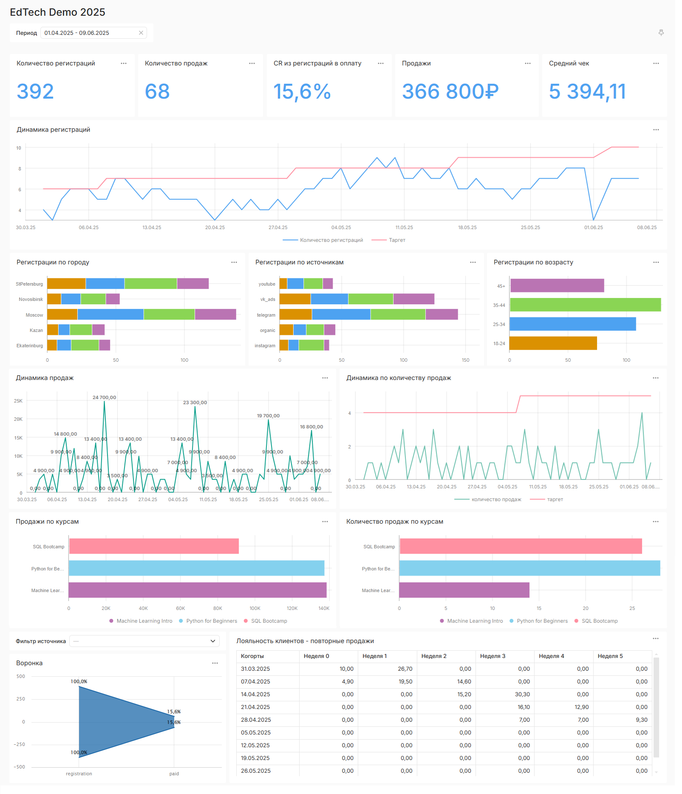

# 📊 EdTech BI Demo

Полноценная демонстрация BI-архитектуры на open-source технологиях: от генерации данных до визуализации.

---

## 📌 Цель проекта

Показать архитектурный подход к построению BI-системы:
- автоматическая генерация данных (эмуляция CRM);
- обработка через DAG в Airflow;
- построение витрин в PostgreSQL и ClickHouse;
- визуализация в DataLens.

---

## 🧱 Архитектура

[CRM (эмуляция)] --> [RAW (PostgreSQL)] --> [CDM (PostgreSQL)] --> [BI (ClickHouse)] --> [DataLens]
|
[Airflow DAGs]


**Компоненты:**
- **PostgreSQL** — два слоя: raw и CDM
- **ClickHouse** — хранение витрин
- **Apache Airflow** — DAG’и для генерации, трансформации и репликации
- **Yandex DataLens** — визуализация отчётов
- **Docker** — контейнеризация и запуск всех сервисов

---

## ⚙️ Как запустить

```bash
git clone https://github.com/Arthur-Shakhverdyan/edtech-bi-demo.git
cd edtech-bi-demo
docker-compose up -d
```

## 🚀 Структура DAG'ов

- **generate_crm_data_dag** — эмуляция CRM-данных, запись в RAW  
- **registration_agg_dag** — агрегация регистраций  
- **payments_agg_dag** — агрегация платежей  
- **cohort_retention_agg_dag** — расчёт когортного удержания  
- **funnel_agg_dag** — построение воронок конверсии  

- **replicate_registration_to_ch_dag** — репликация регистраций из CDM в ClickHouse  
- **replicate_payments_to_ch_dag** — репликация платежей из CDM в ClickHouse  
- **replicate_funnel_to_ch_dag** — репликация воронок из CDM в ClickHouse  
- **replicate_retention_to_ch_dag** — репликация когортного удержания из CDM в ClickHouse  

---

## 📊 Пример визуализации




